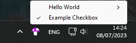

# NotificationIcon.NET

[](https://www.nuget.org/packages/NotificationIcon.NET/)

A cross-platform C# library to display a notification icon in the taskbar notification area ("tray"). Lightweight package with no dependencies.

**Features**

* Buttons
* Checkboxes
* Disabled items
* Nested menus
* Updating the menu in runtime
* Destroying the icon from a different thread

## Windows


## Linux


---

## Usage

```csharp
using NotificationIcon.NET;

string iconImagePath = @"/path/to/icon.png"; //For Windows, use the ".ico" file format. Otherwise, use ".png". Absolute path recommended.
NotifyIcon icon = NotifyIcon.Create(iconImagePath, new List<MenuItem>() {
    new MenuItem("Example Button"),
    new MenuItem("Example Checkbox")
    {
        IsChecked = true,
        Click = (s, e) =>
        {
            MenuItem me = (MenuItem)s!;
            me.IsChecked = !me.IsChecked;
        }
    }
});
icon.Show(); //Use icon.Dispose() to hide
```

## Building the library yourself

> Note: this is not required to use the library.

* To build the C# project: `dotnet build --configuration Release-Portable`
* The native libraries are already compiled in `prebuilt/`.
  * To build them yourself, see [native/README.md](native/README.md).
